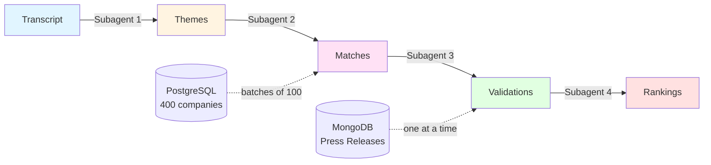
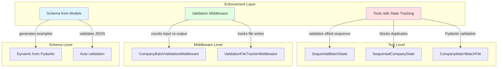

# AI Theme Plays

**Tech Stack:** LangChain + [DeepAgents](https://github.com/langchain-ai/deepagents) + PostgreSQL + MongoDB + S3

DeepAgents is a framework for building LLM agents that can handle complex, multi-step tasks through subagent spawning, filesystem access for context management, and built-in planning tools.

## What This Does

Takes an earnings transcript (like Jensen Huang's GTC keynote) and finds companies that align with the themes mentioned. The workflow:

1. Extract themes from the transcript
2. Match ~400 companies against those themes
3. Validate matches using press release evidence
4. Rank the top 100 by strength of alignment

This kind of systematic analysis (processing thousands of companies, querying databases, validating evidence) is where DeepAgents shines—it lets you break the work into specialized subagents, each handling one piece without polluting the main context.

## The Process



**Simplified pseudocode:**

```python
# Main agent orchestrates 4 subagents
main_agent = create_deep_agent(
    subagents=[
        transcript_analyzer,
        company_matcher,
        press_release_validator,
        final_ranker
    ]
)

# 1. Analyze transcript
themes = transcript_analyzer.run(transcript_file)

# 2. Match companies (processes ALL companies in batches)
offset = 0
while has_more:
    batch = query_postgres(offset, limit=100)
    matches = evaluate_against_themes(batch, themes)
    write_file(f"company_matches/batch_{offset:04d}.json", matches)
    offset += 100

consolidated = consolidate_all_batches()

# 3. Validate with press releases (one company at a time)
for company in consolidated.matches:
    press_releases = query_mongodb(company.ticker)
    validation = assess_evidence(press_releases, themes)
    write_file(f"validations/company_{company.ticker}.json", validation)

# 4. Merge and rank
final = merge_and_rank(matches, validations)
```

## Tools & Middleware: Keeping LLMs On-Task

The challenge with this workflow isn't just the work itself—it's making sure the LLM actually follows the process. LLMs tend to take shortcuts, skip items in loops, or produce inconsistent JSON. Here's how we solved that:

### The Problems

1. **LLMs skip items in loops** - "I'll just process a sample instead of all 400 companies"
2. **Inconsistent JSON structure** - Fields end up outside objects, required fields missing
3. **Context overflow** - Can't fit all 400 companies + press releases in memory at once
4. **Schema drift** - Hardcoded examples in prompts get out of sync with Pydantic models

### The Solutions



**1. Stateful Tools - Sequential Enforcement**

Tools track state and reject invalid operations:

```python
class SequentialBatchState:
    def __init__(self):
        self.expected_offset = 0
        self.batch_size = 100
    
    def validate_and_update(self, offset):
        if offset != self.expected_offset:
            return False, f"Expected offset {self.expected_offset}, got {offset}"
        self.expected_offset += self.batch_size
        return True, ""

# In get_companies_from_postgres tool:
is_valid, error = batch_state.validate_and_update(offset)
if not is_valid:
    return {"error": error}  # Blocks the call
```

**2. Validation Middleware - Input/Output Matching**

Middleware intercepts tool calls and validates counts match:

```python
class CompanyBatchValidationMiddleware(AgentMiddleware):
    def after_tool_call(self, state, runtime):
        # Track how many companies postgres returned
        if tool == "get_companies_from_postgres":
            self.expected_count = len(result["companies"])
    
    def before_tool_call(self, state, runtime):
        # When writing batch file, validate count
        if tool == "write_file" and "batch_" in file_path:
            matches = json.loads(content)["matches"]
            if len(matches) < self.expected_count:
                return {"error": f"Missing {self.expected_count - len(matches)} companies!"}
```

**3. Schema-Driven Prompts - Single Source of Truth**

Instead of hardcoding JSON examples in prompts:

```python
# models.py - Define once
class CompanyMatchBatch(BaseModel):
    ticker: str
    company_name: str
    score: float
    matched_themes: List[str]
    alignment_factors: List[str]

# Generate example dynamically
example = CompanyMatchBatch(
    ticker="NVDA",
    company_name="NVIDIA Corporation",
    score=0.95,
    matched_themes=["AI Compute"],
    alignment_factors=["Leading GPU manufacturer"]
)

# Prompt includes both schema AND example
prompt = f"""
SCHEMA: {CompanyMatchBatchFile.model_json_schema()}
EXAMPLE: {example.model_dump_json(indent=2)}
"""
```

**4. Pydantic Validation in Consolidation**

When reading batch files, validate against the model:

```python
# tools.py - consolidate_batch_files
batch_data_raw = json.loads(content)
try:
    batch_data = CompanyMatchBatchFile.model_validate(batch_data_raw)
except ValidationError as e:
    return {
        "error": f"Invalid structure in {file_path}:\n{e}\n"
                 f"Expected: {CompanyMatchBatchFile.model_json_schema()}"
    }
```

### How Tools & Middleware Interact

1. **Tool is called** → Middleware's `before_tool_call()` can intercept and validate
2. **Tool executes** → Returns structured data
3. **Result returned** → Middleware's `after_tool_call()` can track state
4. **LLM gets result** → Sees error if validation failed, forcing retry

This creates a closed loop where the LLM can't proceed without following the rules.

## Future: Durable Workflows with Checkpointing

Right now, if the workflow is interrupted, you start over. The next step is making it resumable.

**Current State:**
- S3 stores intermediate files (`batch_0000.json`, `batch_0100.json`, etc.)
- But agent state isn't checkpointed
- If crashed at batch 200, you'd restart from batch 0

**Goal: S3-Backed Checkpointer**

LangGraph supports checkpointing—saving agent state after each step. We can extend our S3Backend to act as a checkpointer:

```python
# Future implementation
class S3Checkpointer(BaseCheckpointSaver):
    """Store LangGraph state snapshots in S3"""
    
    def put(self, config, checkpoint, metadata):
        # Save agent state to S3
        key = f"checkpoints/{run_name}/{checkpoint_id}.json"
        s3.put_object(Bucket=bucket, Key=key, Body=json.dumps(checkpoint))
    
    def get_tuple(self, config):
        # Load latest checkpoint from S3
        checkpoints = s3.list_objects(Prefix=f"checkpoints/{run_name}/")
        latest = max(checkpoints, key=lambda x: x['LastModified'])
        return json.loads(s3.get_object(Bucket=bucket, Key=latest['Key'])['Body'].read())

# Usage
agent = create_deep_agent(
    subagents=[...],
    checkpointer=S3Checkpointer(bucket_name=S3_BUCKET_NAME)
)
```

**Resuming After Interruption:**

```python
# 1. Check for existing checkpoint
checkpoint = checkpointer.get_tuple(config={"run_id": run_name})

if checkpoint:
    print(f"Resuming from checkpoint at step {checkpoint['step']}")
    result = agent.invoke(
        input=checkpoint['state'],
        config={"run_id": run_name}
    )
else:
    print("Starting new run")
    result = agent.invoke(
        {"messages": [{"role": "user", "content": task}]},
        config={"run_id": run_name}
    )
```

**Implementation Steps:**

1. Subclass `BaseCheckpointSaver` from LangGraph
2. Implement `put()`, `get_tuple()`, `list()` using our existing S3Backend
3. Add checkpoint metadata tracking (step number, timestamp, which subagent)
4. Add resume logic in `main.py` to check for existing checkpoints
5. Test interruption scenarios (network failure, manual stop, etc.)

This would make the workflow fully durable—crash at company 200? Resume right there.
