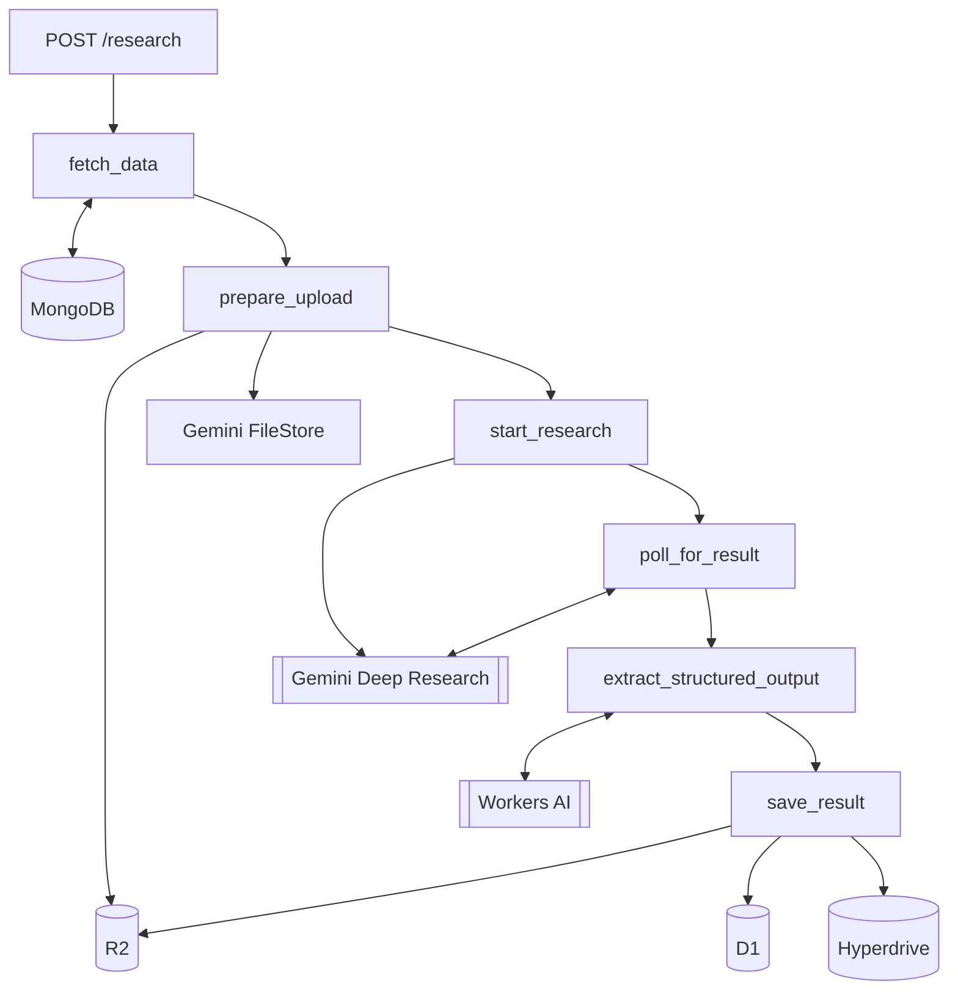

# Deep Research Workflow

Cloudflare Python Workflow for earnings analysis using Google Gemini Deep Research.

## Overview

This workflow automates the analysis of how companies execute on their earnings call promises. Given a ticker and earnings date, it fetches the earnings transcript and all subsequent press releases, then uses Gemini Deep Research to identify alignment between management guidance and actual announcements.

The core question: **Did the company deliver on what they said they would do?**

Results are categorized into three buckets:
- **Confirmed Execution** - Guidance that was followed through with press releases
- **Unaddressed Guidance** - Promises made in earnings with no subsequent PR confirmation
- **New Developments** - PR announcements that weren't previewed in earnings

The workflow runs asynchronously (Gemini Deep Research takes ~30 minutes), persists intermediate state to D1, and outputs structured alignment data to both D1 and Postgres via Hyperdrive for downstream consumption.

## Flow



## Setup

### 1. Install dependencies

```bash
npm install
uv sync
```

### 2. Setup Pyodide-incompatible packages

`langchain>=1.0.0` requires `langgraph` which depends on C extensions (`xxhash`, `ormsgpack`) that have no Pyodide wheels. Run the setup script to install these manually:

```bash
./scripts/setup_pyodide_deps.sh
```

This downloads wheel packages and copies pure Python stubs to `python_modules/`.

### 3. Configure secrets

Create `.env` or set via wrangler:

```bash
npx wrangler secret put AUTH_TOKEN       # API auth
npx wrangler secret put GOOGLE_API_KEY   # Gemini API
npx wrangler secret put CF_AI_API_TOKEN  # Workers AI
```

## Development

```bash
uv run pywrangler dev
```

## Deploy

```bash
./deploy.sh
# or
npm run deploy
```

## Usage

```python
import requests

AUTH_TOKEN = "your_auth_token"
HEADERS = {"Authorization": f"Bearer {AUTH_TOKEN}"}
BASE_URL = "https://<worker-url>.dev"

# Start research job
resp = requests.post(f"{BASE_URL}/research", headers=HEADERS, json={
    "ticker": "AAPL",
    "earnings_date": "2025-01-30"
})
job_id = resp.json()["job_id"]

# Check status
resp = requests.get(f"{BASE_URL}/status/{job_id}", headers=HEADERS)
print(resp.json()["status"])  # pending -> running -> polling -> completed

# Get result
resp = requests.get(f"{BASE_URL}/result/{job_id}", headers=HEADERS)
print(resp.json()["result_text"])
```

## Job States

| Status | Description |
|--------|-------------|
| `pending` | Workflow starting |
| `running` | Fetching data |
| `polling` | Waiting for Gemini |
| `completed` | Result available |
| `failed` | Error occurred |
