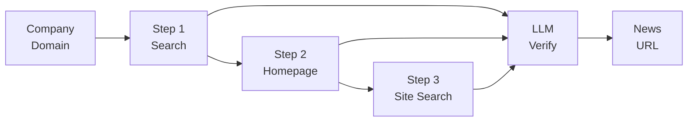
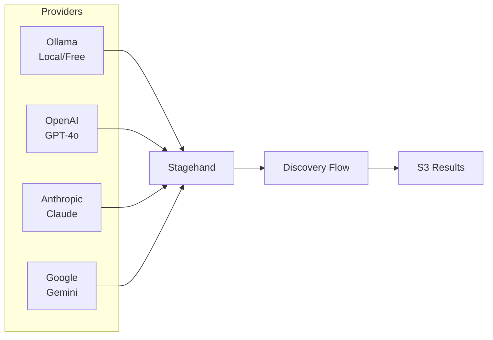
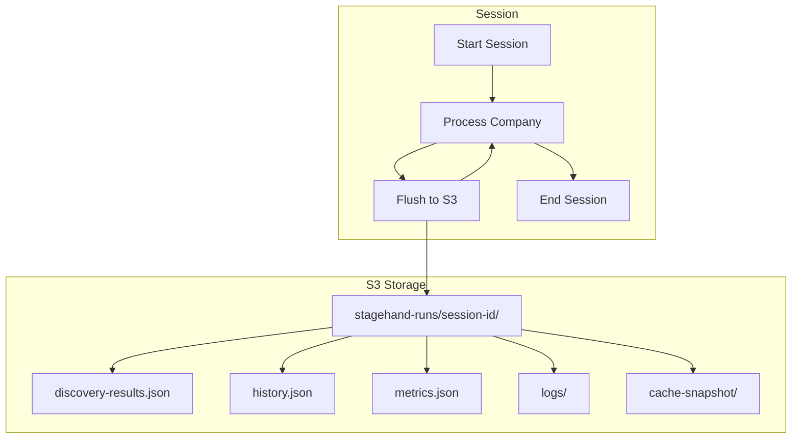
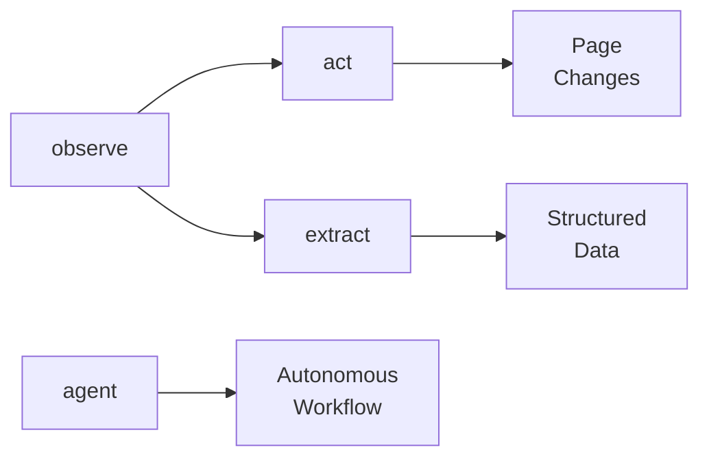
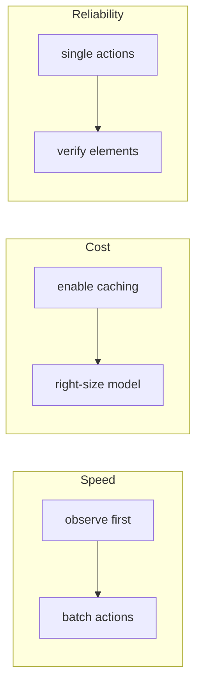

# Company News/PR Discovery with Stagehand

Automated discovery of company news and press release pages using browser automation and multi-provider LLM verification.

## The Problem

Given a company like "Apple" or "Walmart", find the URL of their official press release listing page (e.g., `apple.com/newsroom`).

This is harder than it sounds:

| Challenge | Example |
|-----------|---------|
| **No standard location** | `/news`, `/newsroom`, `/press`, `/media`, `/about/press-releases` |
| **Hidden navigation** | Links buried in dropdown menus or footers |
| **Articles vs. listings** | Search returns individual articles, not the main listing page |
| **Dynamic content** | JavaScript-heavy sites need real browser automation |
| **False positives** | Blogs, whitepapers, SEC filings look similar but aren't press releases |

This project solves these challenges with a 3-step discovery flow combining search engines, heuristic filtering, and LLM verification.

**Test companies**: See [`companies.ts`](./companies.ts) for the 30 companies used for testing (Apple, Amazon, Disney, Nike, etc.)

## How It Works



| Step | Method | Description |
|------|--------|-------------|
| 1 | **Search** | Query DuckDuckGo for `site:{domain} news OR press` and verify top results |
| 2 | **Homepage** | Extract links from nav/header/footer, expand dropdowns, verify candidates |
| 3 | **Site Search** | Use the site's own search bar to find news/press pages |

Each step runs LLM verification to confirm the page shows a **list of press releases** (not a single article). See [`src/prompts.ts`](./src/prompts.ts) for the verification prompts.

**Core logic**: [`src/news-discovery.ts`](./src/news-discovery.ts)

## Multi-Provider LLM Support

Compare discovery accuracy across different LLM providers:



| Provider | Model | Use Case |
|----------|-------|----------|
| Ollama | `gpt-oss:20b` | Local inference, no API costs |
| OpenAI | `gpt-4o`, `gpt-4o-mini` | High accuracy, fast |
| Anthropic | `claude-sonnet-4-20250514` | Strong reasoning |
| Google | `gemini-2.5-flash` | Fast, cost-effective |

**Provider setup**: [`src/llm-providers.ts`](./src/llm-providers.ts)

## S3 Persistence

All session data is automatically captured to S3 for analysis and debugging. Data is flushed after each company, so you don't lose progress if interrupted.



| File | Contents |
|------|----------|
| `discovery-results.json` | Per-company results with URLs and methods |
| `history.json` | Stagehand action history (act, extract, observe) |
| `metrics.json` | Token usage per primitive (prompt vs completion) |
| `logs/` | Batched log entries |
| `cache-snapshot/` | Cached LLM responses for reproducibility |

**Persistence layer**: [`utils/stagehand-s3-persistence.ts`](./utils/stagehand-s3-persistence.ts)

## Quick Start

### 1. Install Dependencies

```bash
npm install --legacy-peer-deps
```

### 2. Configure Environment

```bash
cp .env.example .env
```

Required variables (see [`.env.example`](./.env.example)):

```bash
# AWS (required for S3 persistence)
AWS_REGION=us-east-1
AWS_ACCESS_KEY_ID=your_key
AWS_SECRET_ACCESS_KEY=your_secret
S3_PERSISTENCE_BUCKET=your-bucket

# LLM Provider API Keys (at least one required)
OPENAI_API_KEY=sk-...
ANTHROPIC_API_KEY=sk-ant-...
GOOGLE_GENERATIVE_AI_API_KEY=...

# Ollama (if using local inference)
OLLAMA_BASE_URL=http://localhost:11434
```

### 3. Run Discovery

```bash
# With browser visible (recommended for debugging)
STAGEHAND_HEADLESS=false npm run test:discovery:openai:mini

# Headless mode
npm run test:discovery:openai

# Other providers
npm run test:discovery:claude
npm run test:discovery:gemini
npm run test:discovery        # Default: Ollama
```

**Test harness**: [`tests/test-news-discovery.ts`](./tests/test-news-discovery.ts)

### 4. Compare Results

```bash
npm run analyze
```

**Analysis script**: [`analysis/compare-models.ts`](./analysis/compare-models.ts)

## Project Structure

```
.
├── config.ts                        # Central configuration
├── companies.ts                     # Test company list (30 companies)
├── src/
│   ├── news-discovery.ts            # 3-step discovery flow
│   ├── llm-providers.ts             # Multi-provider LLM factory
│   ├── prompts.ts                   # LLM verification prompts
│   ├── types.ts                     # TypeScript types
│   └── utils.ts                     # URL filtering, logging helpers
├── tests/
│   └── test-news-discovery.ts       # Main test harness
├── analysis/
│   └── compare-models.ts            # Model comparison script
├── utils/
│   └── stagehand-s3-persistence.ts  # S3 persistence layer
└── .env.example                     # Environment template
```

## Configuration

All settings in [`config.ts`](./config.ts) can be overridden via environment variables:

| Variable | Default | Description |
|----------|---------|-------------|
| `LLM_PROVIDER` | `ollama` | Provider: ollama, openai, anthropic, google |
| `LLM_MODEL` | `gpt-oss:20b` | Model name (provider-specific) |
| `STAGEHAND_HEADLESS` | `true` | Run browser headlessly |
| `STAGEHAND_VERBOSE` | `0` | Verbosity: 0=silent, 1=normal, 2=debug |
| `DISCOVERY_MAX_SEARCH_RESULTS` | `10` | Max search results to extract |
| `DISCOVERY_MAX_CANDIDATES` | `5` | Max candidates to verify per step |
| `DISCOVERY_TIMEOUT_MS` | `30000` | Page navigation timeout |

## Adding Companies

Edit [`companies.ts`](./companies.ts):

```typescript
export const TEST_COMPANIES: CompanyInput[] = [
  { name: 'Apple Inc', website: 'https://www.apple.com' },
  { name: 'Microsoft Corporation', website: 'https://www.microsoft.com' },
  // Add more...
];
```

## LLM Verification

Each candidate URL is verified with a detailed prompt (see [`src/prompts.ts`](./src/prompts.ts)). The LLM checks:

1. **Shows a LIST of MULTIPLE press releases** (not a single article)
2. **Is the MAIN page** (not page 2, 3, etc.)
3. **Contains formal PRESS RELEASES** (not blogs, whitepapers, SEC filings)
4. **URL path is simple** (no article slugs or dates)
5. **Shows LIST VIEW** (multiple headlines, not full article body)

## Troubleshooting

| Issue | Solution |
|-------|----------|
| Bot detection on DuckDuckGo | Run with `STAGEHAND_HEADLESS=false` |
| AWS credential errors | Set `AWS_ACCESS_KEY_ID` and `AWS_SECRET_ACCESS_KEY` in `.env` |
| Ollama connection failed | Verify Ollama is running: `curl http://localhost:11434/api/tags` |
| No search results | Some sites block search indexing; falls back to homepage exploration |
| Peer dependency warnings | Use `npm install --legacy-peer-deps` |

## Dependencies

- [**Stagehand**](https://stagehand.dev) (`@browserbasehq/stagehand`) - Browser automation with AI
- **AI SDK** (`@ai-sdk/openai`, `@ai-sdk/anthropic`, `@ai-sdk/google`) - LLM providers
- **Ollama Provider** (`ollama-ai-provider-v2`) - Local LLM inference
- **AWS SDK** (`@aws-sdk/client-s3`) - S3 persistence

## Stagehand Reference

This project uses [Stagehand](https://stagehand.dev) for AI-powered browser automation. Here's a quick reference.

### Core Primitives



| Primitive | Purpose | Returns |
|-----------|---------|---------|
| `observe()` | Find actionable elements on page | `Action[]` with selectors |
| `act()` | Perform a single action (click, type) | `ActResult` with success status |
| `extract()` | Pull structured data from page | Typed object matching schema |
| `agent()` | Run autonomous multi-step workflows | `AgentResult` with history |

### Usage Patterns

**observe() - Discover elements before acting**
```typescript
const actions = await stagehand.observe("find the login button");
// Returns: [{ selector: "xpath=...", method: "click", description: "Login button" }]
```

**act() - Single focused actions**
```typescript
await stagehand.act("click the submit button");
await stagehand.act("type %email% into the email field", { variables: { email } });
```

**extract() - Get structured data with schemas**
```typescript
const data = await stagehand.extract("get product info", z.object({
  name: z.string(),
  price: z.string(),  // Use string for "$19.99" format
  inStock: z.boolean()
}));
```

### Best Practices



| Category | Do | Don't |
|----------|-----|-------|
| **Prompting** | "click the Sign In button" | "click the blue button" |
| **Actions** | One action per `act()` call | Combine multiple steps |
| **Secrets** | Use `variables: { password }` | Put credentials in prompts |
| **Speed** | `observe()` first, then act | Sequential `act()` calls |
| **Cost** | Enable `cacheDir` | Skip caching for repeated tasks |

### Caching

Enable caching to skip LLM inference on repeated runs (10-100x faster):

```typescript
const stagehand = new Stagehand({
  cacheDir: ".stagehand-cache"  // Actions cached here
});
```

- **First run**: Uses LLM, caches results
- **Subsequent runs**: Reuses cache, no LLM calls
- **Tip**: Commit cache to version control for CI/CD

### Speed Optimization

1. **Plan with observe()** - Get all selectors in one LLM call, then execute without inference
2. **Set timeouts** - Use `domcontentloaded` instead of waiting for all resources
3. **Reduce DOM** - Strip videos/iframes before processing

### Cost Optimization

1. **Right-size models** - Use `gpt-4o-mini` for simple tasks, save `gpt-4o` for complex ones
2. **Enable caching** - Eliminates redundant LLM calls
3. **Batch extractions** - One `extract()` with full schema vs. multiple calls

## License

ISC
